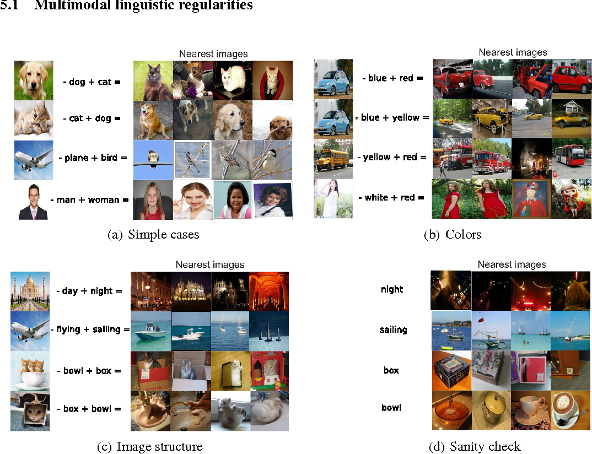
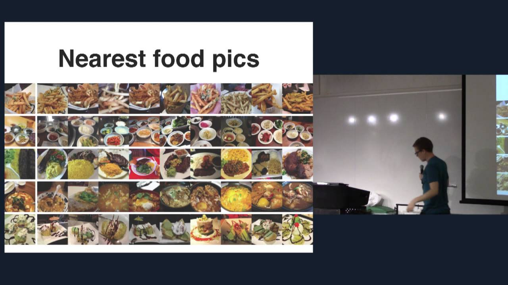

summary: A brief introduction to unstructured data.
id: getting-started-with-vector-databases-introduction-to-unstructured-data
categories: Getting Started
tags: getting-started
status: Published
authors: Frank Liu
Feedback Link: https://github.com/milvus-io/milvus

---

# Getting Started with Vector Databases - Introduction to Unstructured Data

## Introduction
Duration: 1

Welcome to [Milvus codelabs](https://codelabs.milvus.io/). This is the first tutorial, and will be mostly a text-based overview of _unstructured data_. I know, this doesn't sound like a very sexy topic, but before you press that little __x__ button on your browser tab, hear us out.

New data is being generated every day, and is undoubtedly a key driver of both worldwide integration as well as the global economy. From heart rate monitors worn on wrists to GPS positions of a vehicle fleet to videos uploaded to social media, data is being generated at an exponentially increasing rate. The importance of this ever-increasing amount of data cannot be understated; data can help better serve existing customers, identify supply chain weaknesses, pinpoint workforce inefficiencies, and help companies identify and break into new markets, all factors that can enable a company (and you) to generate more $$$.

Not convinced yet? International Data Corporation - also known as _IDC_ - predicts that the _global datasphere_ - a measure of the total amount of new data created and stored on persistent storage all around the world - will grow to 400 zettabytes (a zettabyte = 10<sup>21</sup> bytes) by 2028. At that time, over 30% of said data will be generated in real-time, while 80% of all generated data will be _unstructured_.

<div align="center">
</div>
<p style="text-align:center"><sub>SLIDE 8 FROM ZILLIZ INFO PACK HERE.</sub></p>

## Structured/semi-structured data
Duration: 1

So what exactly is unstructured data? As the name suggests, unstructured data refers to data that cannot be stored in a pre-defined format or fit into an existing data model. Human-generated data - images, video, audio, text, etc - are great examples of unstructured data data. But there are a variety of less mundane examples of unstructured data too. Protein structures, executable file hashes, and even human-readable code are three of a near-infinite set of examples of unstructured data.

Structured data, on the other hand, refers to data that can be stored in a table-based format, while semi-structured data refers to data that can be stored in single- or multi-level array/key-value stores. If none of this makes sense to you yet, don't fret. Bear with us and we'll provide examples to help solidify your understanding of data.

## Some concrete examples
Duration: 2

Still with us? Excellent - let's start by briefly describing structured/semi-structured data. In the simplest terms, traditional structured data can be stored via a relational model. Take, for example, a book database:

| ISBN       | Year |                 Name                 |    Author     |
| ---------- | ---- | ------------------------------------ | ------------- |
| 0767908171 | 2003 | A Short History of Nearly Everything | Bill Bryson   |
| 039516611X | 1962 | Silent Spring                        | Rachel Carson |
| 0374332657 | 1998 | Holes                                | Louis Sachar  |
| ...

<p style="text-align: center"><sub>Ahh, _Holes_. Brings back childhood memories.</sub></p>

In the example above, each row within the database represents a particular book (indexed by ISBN number), while the columns denote the corresponding category of information. Databases built on top of the relational model allow for multiple tables, each of which has its own unique set of columns. These tables are formally known as _relations_, but we'll just call them tables to avoid confusing databases with friends and family members. Two of the most popular and well-known examples of relational databases are _MySQL_ (released in 1995) and _PostgreSQL_ (released in 1996).

Semi-structured data is the subset of structured data that does not conform to the traditional table-based model. Instead, semi-structured data usually comes with keys or markers which can be used to describe and index the data. Going back to the example of a book database, we can expand it to a semi-structured JSON format as so:

    {
      ISBN: 0767908171
      Month: February
      Year: 2003
      Name: A Short History of Nearly Everything
      Author: Bill Bryson
      Tags: geology, biology, physics
    },
    {
      ISBN: 039516611X
      Name: Silent Spring
      Author: Rachel Carson
    },
    {
      ISBN: 0374332657
      Year: 1998
      Name: Holes
      Author: Louis Sachar
    },
    ...

Note how the first element in our new JSON database now contains `Months` and `Tags` as two extra pieces of information, without impacting the two subsequent elements. With semi-structured data, this can be done without the extra overhead of two additional columns for all elements, thereby allowing for greater flexibility.

Semi-structured data is typically stored in a _NoSQL database_ (wide-column store, object/document database, key-value store, etc), as their non-tabular nature prevents direct use in a relational database. _Cassandra_ (released in 2008), _MongoDB_ (released in 2009), and _Redis_ (released in 2009) are three of the most popular databases for semi-structured data today. Note how these popular databases for semi-structured data were released a little over a decade after popular databases for structured data - keep this in mind as we'll get to it later.

## A paradigm shift
Duration: 1

Now that we have a solid understanding of structured/semi-structured data, let's move to talking about unstructured data. Unlike structured/semi-structured data, unstructured data can take any form, be of an arbitrarily large or small size on disk, and can require vastly different runtimes to transform and index. Let's take images as an example: three front-facing successive images of the same German Shephard are _semantically the same_.

_Semantically the same_? What on earth does that mean? Let's dive a bit deeper and unpack the idea of _semantic similarity_. Although these three photos may have vastly different pixel values, resolutions, file sizes, etc, all three photos are of the same German Shephard in the same environment. Think about it - all three photos have identical or near-identical content but significantly different raw pixel values. This poses a new challenge for industries and companies that uses data<sup>1</sup>: how can we transform, store, and search unstructured data in a similar fashion to structured/semi-structured data?

At this point, you're probably wondering: how can we search and analyze unstructured data if it has no fixed size or format? The answer: machine learning (or more specifically, deep learning). In the past decade, the combination of big data and deep neural networks has fundamentally changed the way we approach data-driven applications; tasks ranging from spam email detection to realistic text-to-video synthesis have seen incredible strides, with accuracy metrics on certain tasks reaching superhuman levels. This may sound scary (hello, Skynet), but we're still many decades away from Elon Musk's vision of AI taking over the world.

<sup>1</sup><sub>In essence, this is all industries, all companies, and all inviduals. Including you!</sub>

## A crash course on embeddings
Duration: 2

Let's get back on track. The vast majority of neural network models are capable of turning a single piece of unstructured data into a list of floating point values, also known more commonly as an _embedding_ or _embedding vector_. As it turns out, a properly trained neural network can output embeddings that represent the semantic content of the image<sup>2</sup>. In a future tutorial, we'll go over a vector database use case that uses a pre-determined algorithm to generate embeddings.

<div align="center">
  
</div>
<p style="text-align:center"><sub>An Eastern Towhee. Photo by <a href="https://unsplash.com/photos/CcmxhowdIFc">Patrice Bouchard</a>.</sub></p>

The photo above provides an example of transforming a piece of unstructured data into a vector. With the preeminent ResNet-50 convolutional neural network, this image can be represented as a vector of length 2048 - here are the first three and last three elements: `[0.1392, 0.3572, 0.1988,  ..., 0.2888, 0.6611, 0.2909]`. Embeddings generated by a properly trained neural network have mathematical properties which make them easy to search and analyze. We won't go too much into detail here, but know that, generally speaking, embedding vectors for semantically similar objects are _close to each other in terms of distance_. Therefore, searching across and understanding unstructured data boils down to vector arithmetic.

<div align="center">
  
</div>
<p style="text-align:center"><sub>NOTE: WE SHOULD CREATE OUR OWN VERSION OF THIS, FREE OF COPYRIGHT ISSUES.</sub></p>

As mentioned in the introduction, unstructured data will comprise a whopping 80% of all newly created data by the year 2028. This proportion will continue to increase beyond 80% as industries mature and implement methods for unstructured data processing. This impacts everybody - you, me, the companies that we work for, the organizations that we volunteer for, so on and so forth. Just as new user-facing applications from 2010 onward required databases for storing semi-structured data (as opposed to traditional tabular data), this decade necessitates databases purpose-built for indexing and searching across massive quantites (exabytes) of unstructured data.

The solution? A database for the AI era - a _vector database_. Welcome to our world; welcome to the world of ___Milvus___.

<sup>2</sup><sub>In most tutorials, we'll focus on embeddings generated by neural networks; do note, however, that embeddings can be generated through handcrafted algorithms as well.</sub>

## Unstructured data processing
Duration: 2

Excited yet? Excellent. But before we dive headfirst into vector databases and Milvus, let's take a minute to talk about how we process and analyze unstructured data. In the case of structured and semi-structured data, searching for or filtering items in the database is fairly strightforward. As a simple example, querying MongoDB for the first book from a particular author can be done with the following code snippet (using `pymongo`):

```python
>>> document = collection.find_one({'Author': 'Bill Bryson'})
```

This type of querying methodology is not dissimilar to that of traditional relational databases, which rely on SQL statements to filter and fetch data. The concept is the same: databases for structured/semi-structured data perform filtering and querying using mathematical (e.g. `<=`, string distance) or logical (e.g. `EQUALS`, `NOT`) operators across numerical values and/or strings. For traditional relational databases, this is called _relational algebra_; for those of you unfamiliar with it, trust me when I say it's much worse than linear algebra. You may have seen examples of extremely complex filters being constructed through relational algebra, but the core concept remains the same - traditional databases are _deterministic_ systems that always return exact matches for a given set of filters.

Unlike databases for structured/semi-structured data, vector database queries are done by specifying an input _query vector_ as opposed to SQL statement or data filters (such as `{'Author': 'Bill Bryson'}`). This vector is the embedding-based representation of the unstructured data. As a quick example, this can be done in Milvus with the following snippet (using `pymilvus`):

```python
>>> results = collection.search(embedding, 'embedding', params, limit=10)
```

Internally, queries across large collections of unstructured data are performed using a suite of algorithms collectively known as _approximate nearest neighbor search_, or _ANN search_ for short. In a nutshell, ANN search is a form of optimization that attempts to find the "closest" point or set of points to a given query vector. Note the "approximate" in ANN. By utilizing clever indexing methods, vector databases have a clear accuracy/performance tradeoff: increasing search runtimes will result in a more consistent database that performs closer to a deterministic system, always returning the absolute nearest neighbors given a query value. Conversely, reducing query times will improve throughput but may result in capturing fewer of a query's true nearest values. In this sense, unstructured data processing is a _probabilistic_ process<sup>3</sup>.

<div align="center">
  
</div>
<p style="text-align:center"><sub>Approximate nearest neighbor search, visualized. NOTE: WE SHOULD CREATE OUR OWN VERSION OF THIS, FREE OF COPYRIGHT ISSUES.</sub></p>

ANN search is a core component of vector databases and a massive research area in and of itself; as such, we'll dive deep into various ANN search methodologies available to you within Milvus in a future set of articles.

<sup>3</sup><sub>Vector databases can be made determinstic by selecting a specific index.</sub>

## Wrapping up
Duration: 1

Thanks for making it this far! Here are the key takewaways for this tutorial:
- Structured/semi-structured data are limited to numeric, string, or time data types. Through the power of modern machine learning, unstructured data is represented as high-dimensional vectors of numerical values.
- These vectors, more commonly known as embeddings, are great for representing the semantic content of the unstructured data. Structured/semi-structured data, on the other hand, is semantically as-is, i.e. the content itself is equivalent to the semantics.
- Searching and analyzing unstructured data is done through ANN search, a process that is inherently probabilistic. Querying across structured/semi-structured data, on the other hand, is deterministic.
- Unstructured data processing is very different from semi-structured data processing, and requires a complete paradigm shift. This naturally necessiates a new type of database - the vector database.

This concludes part one of this introductory series - for those of you new to vector databases, welcome to Milvus! In the next tutorial, we'll cover vector databases in more detail:
- We'll first provide a birds-eye view of the the Milvus vector database.
- We'll then follow it up with how Milvus differs from vector search libraries (FAISS, ScaNN, DiskANN, etc).
- We'll also discuss how vector databases differ from vector search plugins (for traditional databases and search systems).
- We'll wrap up with technical challenges associated with modern vector databases.

See you in the next tutorial.
